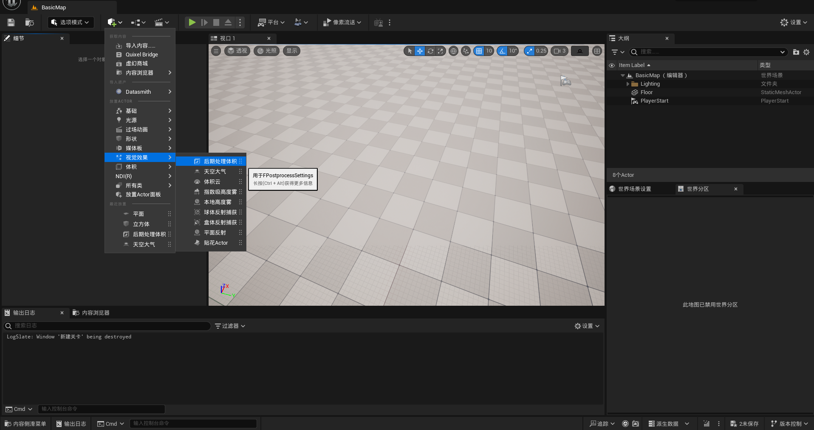
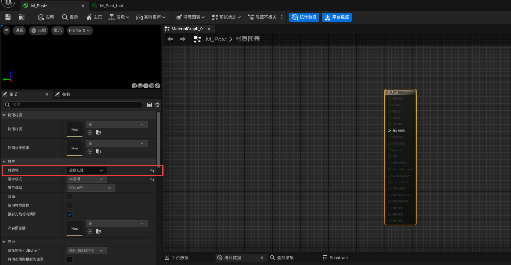
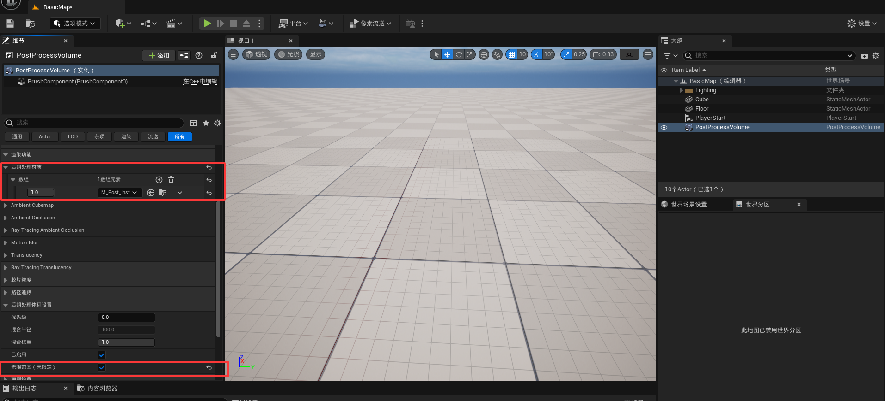
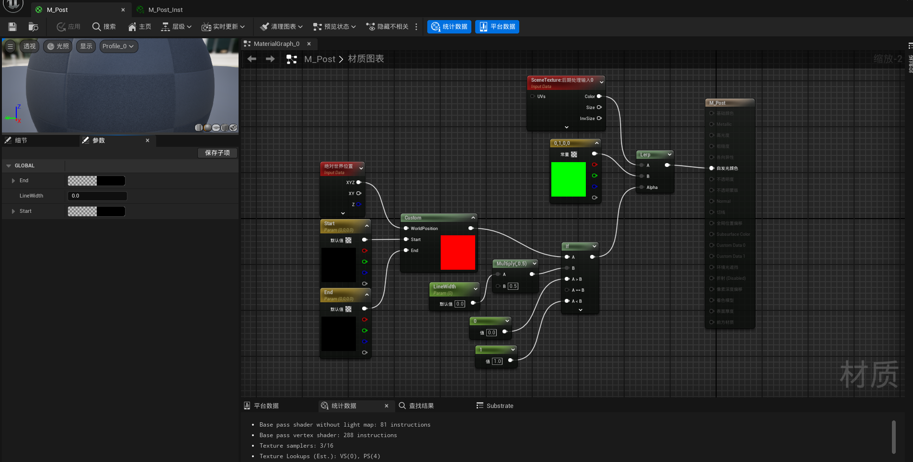
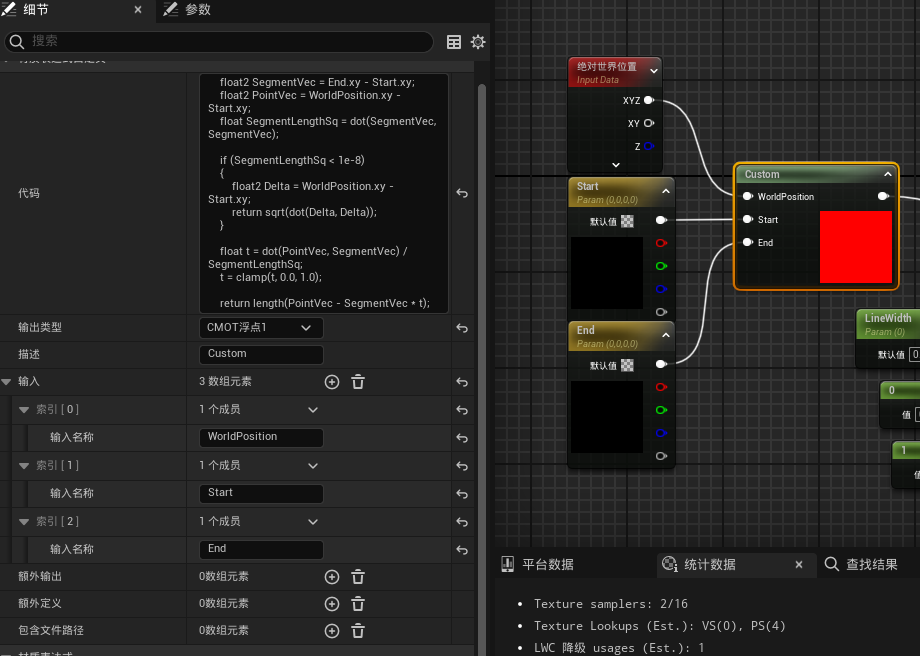
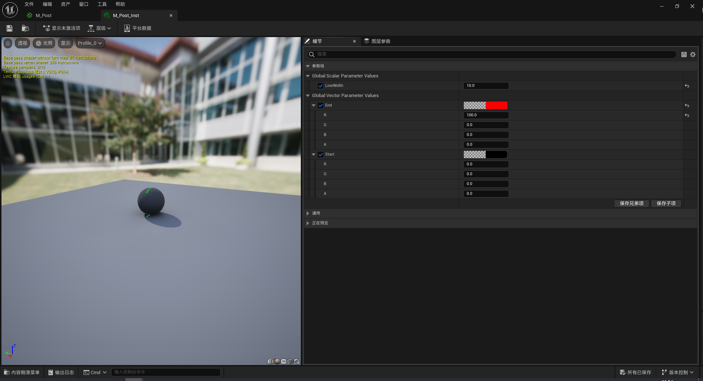
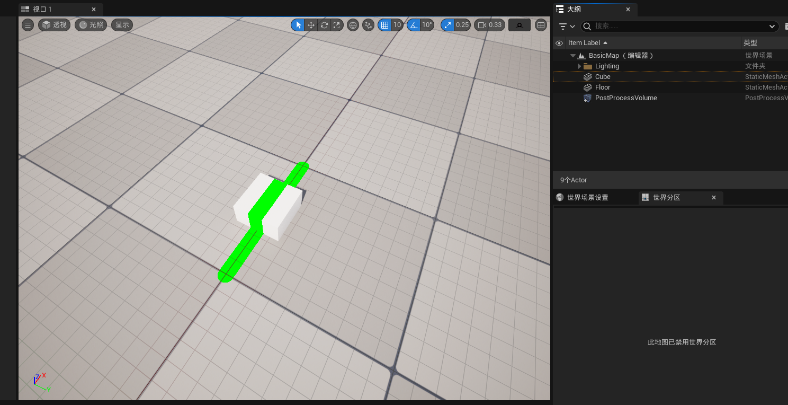

# 后处理
本节介绍如何使用后期处理材质实现单个线段的贴地渲染效果。
## 步骤
#### 新建Basic关卡，添加后期处理体积

#### 新建材质M_Post，并创建材质实例M_Post_Inst，材质设置如下
- 材质域：后期处理


#### 设置后期处理体积
- 增加后期处理材质，设置为M_Post_Inst
- 勾选无限范围


#### 材质M_Post节点内容如下

#### custom节点设置

- 输入
    - WorldPosition
    - Start
    - End
- 输出类型
    - float1
- 代码
    ```
    // 计算当前像素的世界位置到线段的距离（忽略Z轴）

    float2 SegmentVec = End.xy - Start.xy;
    float2 PointVec = WorldPosition.xy - Start.xy;
    float SegmentLengthSq = dot(SegmentVec, SegmentVec);
    
    if (SegmentLengthSq < 1e-8)
    {
        float2 Delta = WorldPosition.xy - Start.xy;
        return sqrt(dot(Delta, Delta));
    }
    
    float t = dot(PointVec, SegmentVec) / SegmentLengthSq;
    t = clamp(t, 0.0, 1.0);

    return length(PointVec - SegmentVec * t);
    ```
#### 设置M_Post_Inst相关参数观察效果

