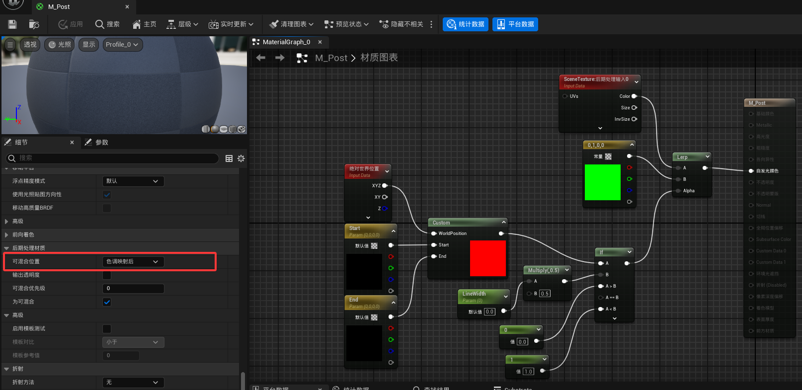
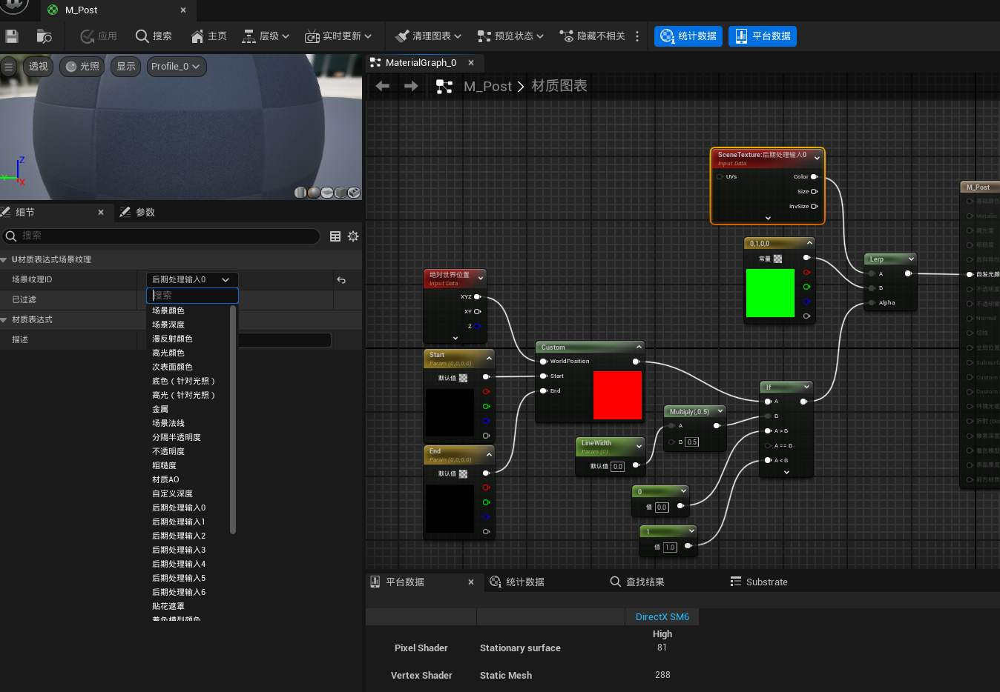

# 延迟渲染管线
本节介绍延迟渲染管线。
### 定位后处理Pass
`Engine\Source\Runtime\Renderer\Private\DeferredShadingRenderer.cpp`  
```
// 延迟渲染的内容在该函数中实现，可以在其中找到后处理Pass
FDeferredShadingSceneRenderer::Render()
{
	// 漫反射、间接光、环境光遮挡
	...

	// 天空大气、雾、体积云、不透明渲染
	...

	// 扩展点1
	RendererModule.RenderPostOpaqueExtensions(GraphBuilder, Views, SceneTextures);

	// 半透明、光线追踪
	...

	// 扩展点2
	RendererModule.RenderOverlayExtensions(GraphBuilder, Views, SceneTextures);

	// 距离场光照、解析场景颜色
	AddResolveSceneColorPass(...);

	// 扩展点3
	RendererModule.RenderPostResolvedSceneColorExtension(GraphBuilder, SceneTextures);

	// 后处理
    AddPostProcessingPasses(
				GraphBuilder,
				...
				PostProcessingInputs,
				...);
}
```
`Engine\Source\Runtime\Renderer\Private\PostProcess\PostProcessing.cpp`  
后处理材质在此处根据不同的混合位置添加Pass
```
void AddPostProcessingPasses(
	FRDGBuilder& GraphBuilder,
	...
	const FPostProcessingInputs& Inputs,
	...)
{
	// ...

	// 例子中的混合位置为BL_AfterTonemapping
	const FPostProcessMaterialChain MaterialChain = GetPostProcessMaterialChain(View, BL_AfterTonemapping);
	AddPostProcessMaterialChain(GraphBuilder, View, GetPostProcessMaterialInputs(SceneColor), MaterialChain);

	// ...
}
```
对应材质中的混合位置选项：

### 渲染资源
FSceneTextures是UE渲染系统中的核心资源，它封装了渲染过程中所需的各种关键纹理（如场景颜色、深度、模板、GBuffer等）
```
struct FSceneTextures : public FMinimalSceneTextures
{
	//~ FMinimalSceneTextures
	FRDGTextureMSAA Color{};
	FRDGTextureMSAA Depth{};
	FRDGTextureSRVRef Stencil{};
	FCustomDepthTextures CustomDepth{};
	//~ FMinimalSceneTextures

	FRDGTextureRef GBufferA{};
	FRDGTextureRef GBufferB{};
	FRDGTextureRef GBufferC{};
}
```
对应材质中SceneTexture中的场景纹理ID选项
