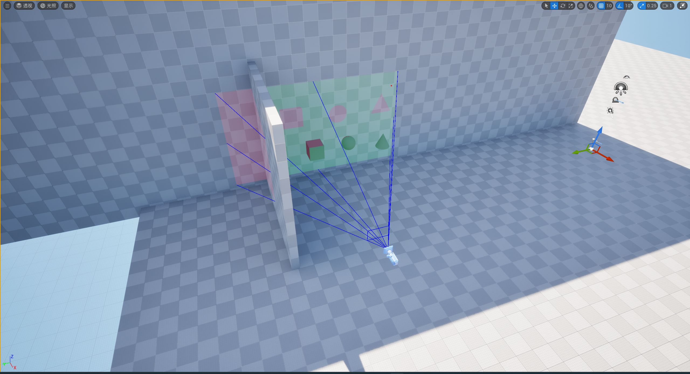
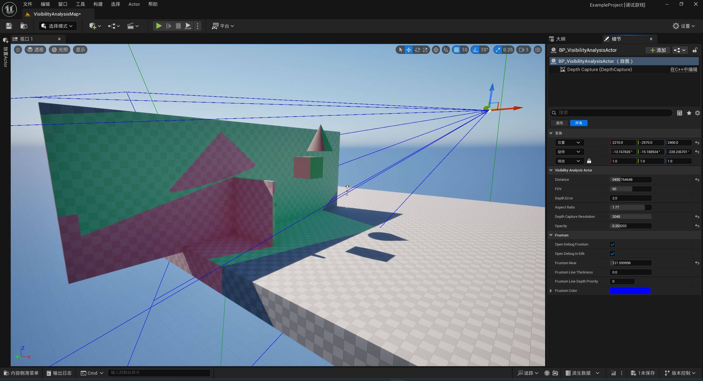
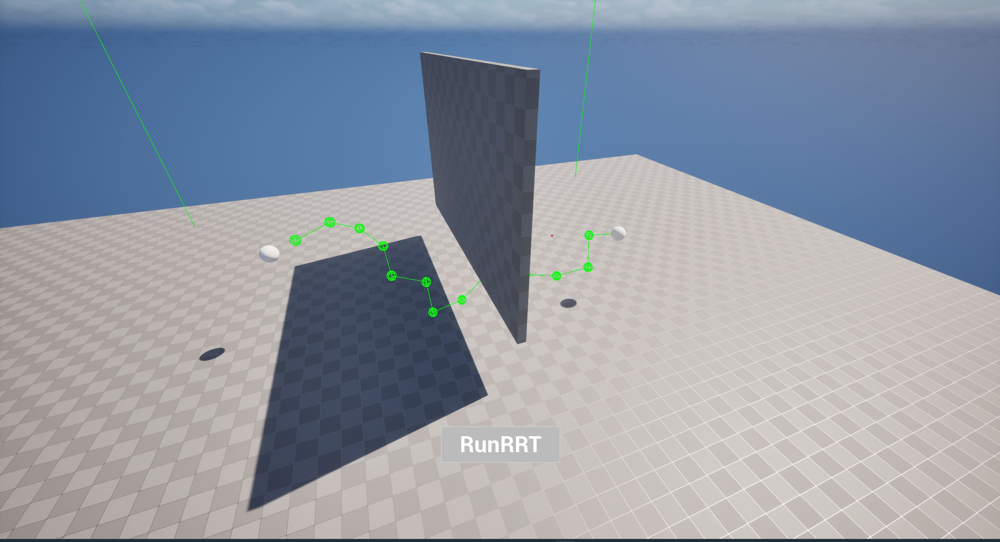
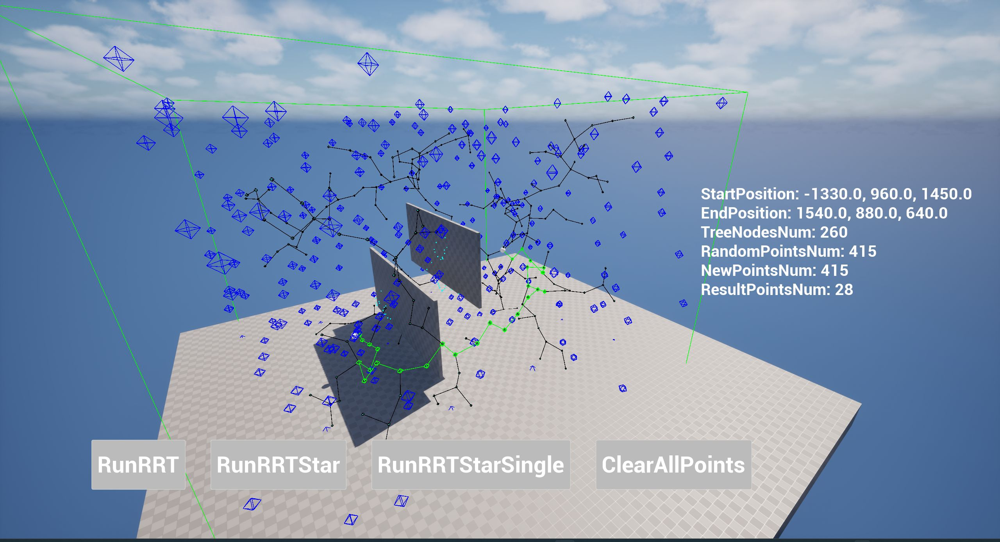
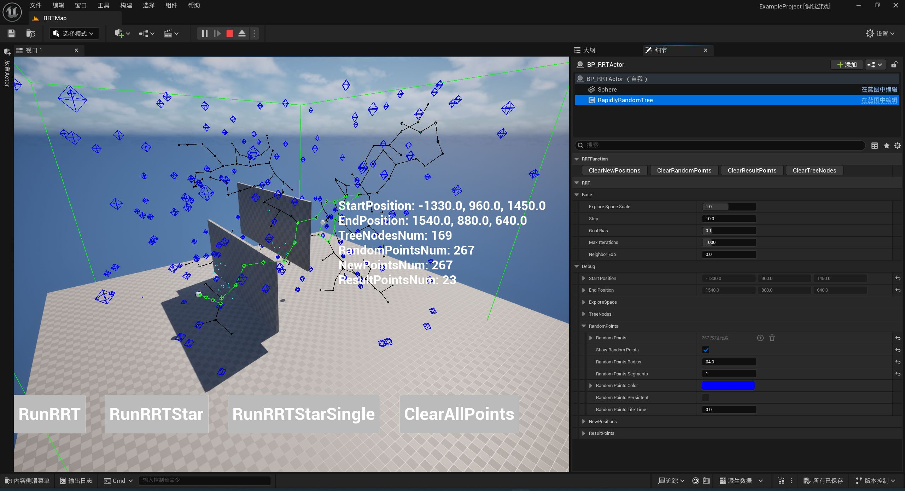

# UtilityTools
记录杂项功能，功能放在插件UtilityTools下，提供一个示例工程`ExampleProject.uproject`。  
该工程Content文件夹下存放Maps，每个Map对应展示独立的功能。
## Build工程
1. 复制命令`git clone https://github.com/YaoZhoubo/UE-UtilityTools.git`将工程克隆到本地
2. 右键 `ExampleProject.uproject`， 点击`Generate Visual Studio project files` 生成Visual Studio工程文件
3. 打开解决方案`ExampleProject.sln`构建项目  

注：UE版本5.5
## 功能
### 1. 可视域分析

提供如下关键参数：
* Distance
* FOV
* DepthError
* AspectRatio
* DepthCaptureResolution
* Opacity

### 2. RRT

提供如下关键参数：
* ExploreSpaceScale
* Step
* GoalBias
* MaxIterations
* NeighborExp

